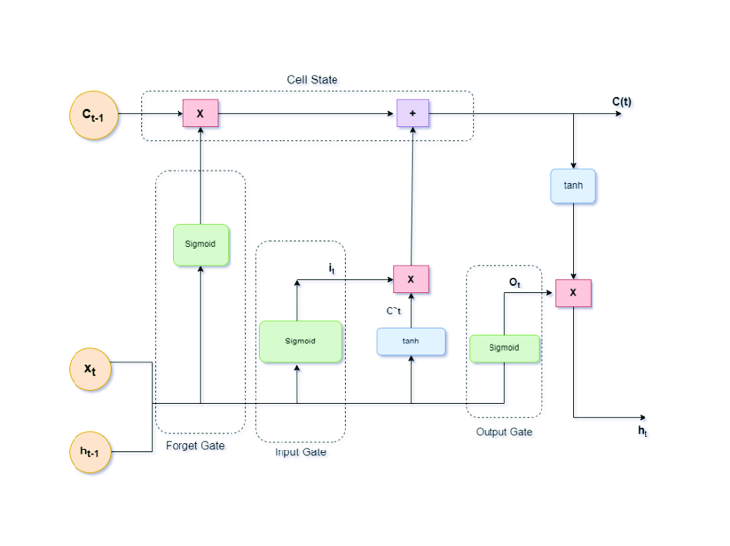

#  💹 Multivariate Stock Price Prediction - LSTM
This project implements a time series multivariate analysis using RNN/LSTM for stock price predictions. A deep RNN model was created and trained on five years of historical Google stock price data to forecast the stock performance over a two-month period.

## Data Set 📥([Google Stock Price](https://finance.yahoo.com/quote/GOOG/history))
The dataset utilized comprises historical records for the stock price of [Alphabet Inc. (GOOG)](https://finance.yahoo.com/quote/GOOG/history), captured on daily basis.

The dataset is sourced from [Yahoo Finance](https://finance.yahoo.com/) and contains the following fields: *Opening price, Highest price, Lowest price, Closing price, Adjusted closing price, and Trading volume*.

The raw, interim, and preprocessed datasets can be located in their corresponding subfolders in the main data directory.

## 🛠️ Architectural Diagram  
The following diagram represents the architecture of the stock price prediction model:  




## 📂 Repository Structure
```
💹 Multivariate Stock Price Prediction
├── 📂data
│   ├──📂interim
|   │   ├──google_stock_price_recent.csv
│   ├──📂 processed
|   │   ├──google_stock_price_processed_test.csv
|   │   ├──google_stock_price_processed_train.csv
|   │   ├──google_stock_price_processed_validate.csv
│   ├──📂 raw
|   │   ├──google_stock_price_full.csv
├── README.md

```

## 🛠️ Tech Stack
- **Python** 🐍  
- **TensorFlow/Keras** 🔥
- **LSTM**
- **NumPy & Pandas** 📊  
- **Matplotlib & Seaborn** 📉
- **Hugging Face**🤗


## 📌 Features
| Topic | Description |
|-------------------------------|------------------------------------------------|
| **Multivariate Analysis** | Uses multiple stock features (Open, High, Low, Close, Adjusted Close, Volume) for robust predictions. |
| **LSTM-based Approach** | Leverages RNN/LSTM to model sequential dependencies in stock price data. |
| **Explainability (SHAP)** | Analyzes feature importance to interpret model decisions. |
| **Visualization (TensorBoard)** | Monitors training performance and helps in debugging. |
| **Deployment (TF Serving)** | Provides a scalable and production-ready model hosting solution. |
| **NLP Integration (FinBERT)** | Enhances predictions by incorporating financial sentiment analysis. |


## Development Team
- `Aakaash M S`
- `Karthik Ram S`
- `Aniketha Prasad`
- `Riya Rajesh`

## 🤝 Contributing  
Contributions are welcome! Feel free to fork the repository, work on new features, and submit pull requests.  

## 📝 License  
This project is licensed under the MIT License. 
